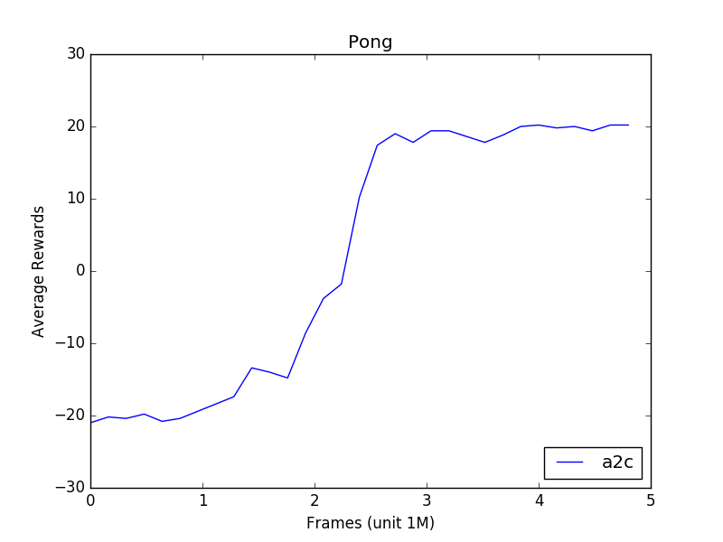
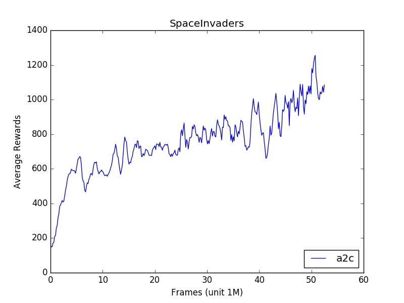

# Pytorch Implementation of A2C

This repo implements the A2C algorothm for reinforcement learning with emphasis on 
speed and modularity. A2C is the synchronized version of 
[Asynchronous advantage actor-critic (A3C)](https://arxiv.org/pdf/1602.01783.pdf). A2C has
been implemented and studied by many AI researchers and notablely been part 
of the [OpenAI baseline](https://blog.openai.com/baselines-acktr-a2c/). However, the 
detailed description of A2C is hard to find online. In this project, we implement our own
with reference to the [OpenAI baseline](https://github.com/openai/baselines/tree/master/baselines/a2c)
and note down some key design choices to help understand the codebase.

##Design

In the original A3C, N instances of the enviroment, e.g. an Atari game, run asynchronously 
and each instance has its own actor to produce trajactories (sequences of game play timesteps)
used for asynchronous parameter updates. A straightforward modification would be to wait until
every environment to produce a trajactory and then batch those trajactories together for one update.
However, this approach is slow because it does not use GPU efficiently. In A2C, a batch of environments
are sychronized at every step, meaning that they produce a batch of states, the agent consume that batch
and produce a batch of actions, and then the environments perform corresponding actions to produce the
next batch of states. This method can maximize the utilization of GPU and thus increase speed. 

In A3C, each enviroment collect a trajectory of maximum length T and the trajectory may be shorter 
if end state is encountered. In A2C, we naturally repeat the batched step T times to collect N trajectories
of length T. However, end states may appear in one or more trajactories. In those cases, the trajectory is
simply a concatenation of two shorter trajectories. For example, if T = 5, it may happen that the first 2
node in the trajectory record the information of the last two frames of one episode and the last 3 node
in the trajactory record the begining of a new episode. In this way, we can easily convert N trajectories
if length T into N * T pairs of (input, target) tuples to maximize the training speed.

## Performance

This implementation is very fast. It runs at 2300 frames/s on my 4 core CPU + GTX1080 while
training on Pong with 16 environments/processes, which is more than 20% faster than some 
[existing implementation](https://github.com/ikostrikov/pytorch-a2c-ppo-acktr) running on the same machine.
Benchmarking on machines with more CPU cores will be added.





## Usage
```
python3 main.py --env_name SpaceInvadersNoFrameskip-v4 --num_envs 16 --exp_name run1
```
See main.py for a complete list of optional command line arguments.

## Future Work
1. [NoisyNet for exploration](https://arxiv.org/abs/1706.10295)
2. [ACKTR](https://arxiv.org/abs/1708.05144)
